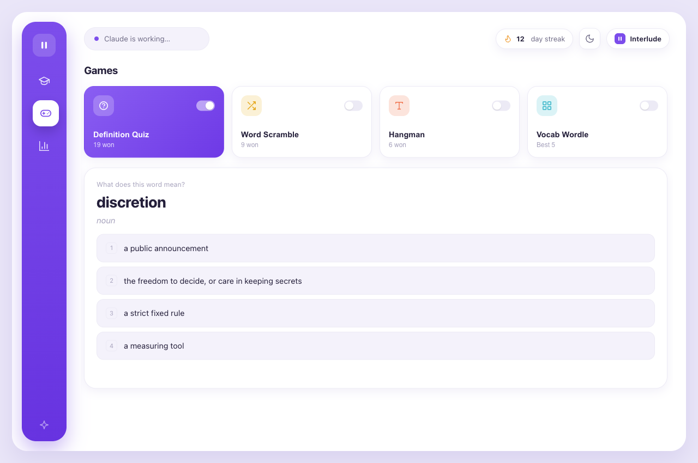

<div align="center">

# 🎴 Interlude

### Turn Claude's thinking time into learning time.

**Interlude** is a tiny, no-typing companion for [Claude Code](https://claude.com/claude-code).
While Claude works, a little window quietly pops up so you can learn English words and play quick
word games. The moment Claude finishes — or needs you — it counts down and closes itself, out of
your way exactly when it's time to read or reply.

<br />

[](#-requirements)
[](https://www.python.org/)
[](#-how-it-works)
[](#-how-it-works)
[](#)
[](LICENSE)

<br />


</div>

<br />

## ✨ Highlights

- 🧠 **Learn while you wait** — spaced-repetition flashcards (Leitner boxes) surface the words you're about to forget.
- 🎮 **Word games + Arcade** — four quick word games (Definition Quiz, Word Scramble, Hangman, Vocab Wordle) plus an **Arcade** section with a vendored, MIT-licensed [2048](https://github.com/gabrielecirulli/2048) that **saves and resumes mid-game** — stop in the middle and pick up right where you left off.
- 📈 **Progress you can see** — streaks, mastery gauge, review history, and per-box charts.
- 🪄 **Zero friction** — appears on its own while Claude thinks, closes on its own when Claude's done.
- 🕶️ **No Dock icon, no menu bar** — a native WKWebView popup, not a browser tab or PWA.
- 🔒 **Fully local** — no accounts, no telemetry, no dependencies. Everything runs on `127.0.0.1`.
- 🌗 **Light & dark** — follows a clean violet theme, day or night.

<br />

## 🚀 Install

```bash
curl -fsSL https://raw.githubusercontent.com/hamedvali/interlude/main/install.sh | bash
```

Then **restart Claude Code**. That's it — next time Claude runs for more than a few seconds,
Interlude appears. ✨

> [!NOTE]
> **macOS only.** Requires `python3` and `osascript`, both of which ship with macOS. The window is
> a native WKWebView popup — no browser, no PWA, no Dock icon.

<br />

## 📸 A look inside

<div align="center">

<table>
  <tr>
    <td width="50%" valign="top">
      <br />
      <b>📊 Progress</b> — mastery gauge, review history, and your Leitner boxes at a glance.
    </td>
    <td width="50%" valign="top">
      <br />
      <b>🎮 Play</b> — pick from four fast word games between prompts.
    </td>
  </tr>
  <tr>
    <td width="50%" valign="top">
      <br />
      <b>🎴 Learn</b> — one card at a time, scheduled by how well you know it.
    </td>
    <td width="50%" valign="top">
      <br />
      <b>👋 Auto-close</b> — a gentle "closing in 3…2…1" when Claude is ready.
    </td>
  </tr>
</table>

</div>

<br />

## ⚙️ How it works

Interlude installs four **global** [Claude Code hooks](https://docs.claude.com/en/docs/claude-code/hooks)
into `~/.claude/settings.json`. They call a small local control script that manages a
zero-dependency Python web server and a native macOS popup window:

| Hook event         | When it fires             | What Interlude does                                                |
|--------------------|---------------------------|-------------------------------------------------------------------|
| `UserPromptSubmit` | You send a prompt         | ⏳ Arms a timer; opens the window if Claude is still busy after ~3s |
| `PostToolUse`      | Claude runs a tool        | 🔁 Keeps the window up (and to the front) while work continues     |
| `Stop`             | Claude finishes replying  | 👋 Shows a "closing in 3…2…1" modal, then closes                   |
| `Notification`     | Claude needs your input   | 🚪 Closes the window so you can respond                            |

The window is a native **WKWebView** popup rendered by `osascript` with an *accessory* activation
policy — so it shows on screen but adds **no Dock icon and no menu bar**. It auto-closes by tracking
its own process, and re-surfaces itself on the next prompt if it's already open. Everything runs on
`127.0.0.1` — nothing leaves your machine.

<br />

## 🔄 Auto-update

Once installed, Interlude keeps itself current. It checks its GitHub repo in the background
(a few times a day, throttled), and when a newer version is out it **downloads and applies it
for you** — copying the new files in, preserving your progress and saved games, and restarting
its own server on the same port. The open window shows a small toast through the whole
lifecycle (*downloading → installing → updated*) and reloads itself when it's done. Code
updates need no action; only a change to the Claude Code **hook wiring** asks you to restart
Claude Code, and the toast tells you when that's the case.

It only ever **copies files** from the same pinned HTTPS repo you installed from — it never
runs a downloaded script — and every step is best-effort, so a failed check never disrupts a
hook or the app.

```bash
interlude update       # check + apply now (ignores the throttle)
interlude update off   # disable auto-update  (or set INTERLUDE_NO_UPDATE=1)
interlude update on    # re-enable
```

<br />

## 🎛️ Controls

```bash
interlude off          # pause Interlude (stops opening the window)
interlude on           # resume
interlude status       # show version, server, and window state as JSON
interlude update       # check for and apply a new version now
interlude stop-server  # stop the background web server
interlude version      # print the version
```

If `~/.local/bin` isn't on your `PATH`, run it directly:
`python3 ~/.interlude/interlude.py <command>`.

<br />

## 🎨 Customize

- **📝 Words** — edit `~/.interlude/words.json` (a list of `{word, meaning, …}`).
- **⏱️ Open delay** — set `INTERLUDE_DELAY` (seconds) before the window appears (default `3`).
- **📐 Window size** — set `INTERLUDE_WIDTH` / `INTERLUDE_HEIGHT` (default `1240`×`840`).
- **🔌 Port** — set `INTERLUDE_PORT` (default `47615`) if it clashes with something.

Changes to hooks or env take effect after you restart Claude Code.

<br />

## 🧹 Uninstall

```bash
curl -fsSL https://raw.githubusercontent.com/hamedvali/interlude/main/uninstall.sh | bash
```

This removes the hooks (with a settings backup), the `interlude` CLI, and `~/.interlude`.
Add `--keep-data` to preserve your learning progress.

<br />

## 🛠️ Development

Clone the repo and install from your local checkout — no download, no GitHub needed:

```bash
git clone https://github.com/hamedvali/interlude.git
cd interlude
bash install.sh --local
```

The app lives in `app/`:

| File            | Role                                                          |
|-----------------|--------------------------------------------------------------|
| `interlude.py`  | Hook controller — decides when to open/close the window      |
| `webview.js`    | The native WKWebView popup, run via `osascript`              |
| `server.py`     | Zero-dependency stdlib web server                            |
| `app.html`      | The Learn / Play / Progress UI                               |
| `games/`        | Vendored MIT arcade games + the save/resume bridge & theme   |

Arcade games live in `app/games/<id>/` with their upstream `LICENSE` kept verbatim. A tiny
shared `games/_bridge.js` mirrors each game's `localStorage` to the server so play resumes
mid-game, and `games/_theme.css` blends them with the Interlude theme. See
[`app/games/CREDITS.md`](app/games/CREDITS.md) for attributions and how to add more.

`INTERLUDE_HOME` overrides the install location — handy for isolated testing.

<br />

## 📋 Requirements

- 🍎 **macOS**
- 🐍 **`python3`** and **`osascript`** — both ship with macOS

<br />

## 📄 License

[MIT](LICENSE) © Hamed Valigholizadeh

Bundled arcade games are third-party open-source projects under their own (MIT) licenses,
kept verbatim in `app/games/<id>/LICENSE`. See [`app/games/CREDITS.md`](app/games/CREDITS.md).

<div align="center">
<br />
<sub>Built for the little pauses. 🎴</sub>
</div>
