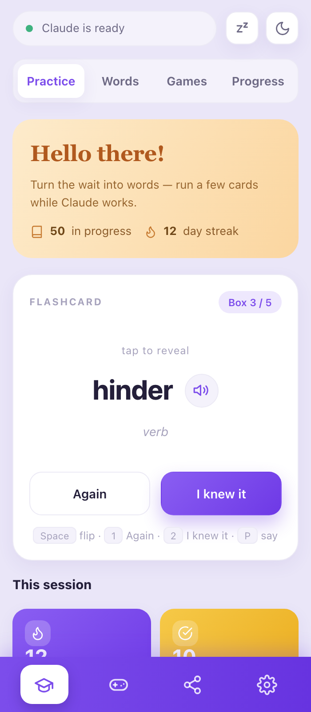
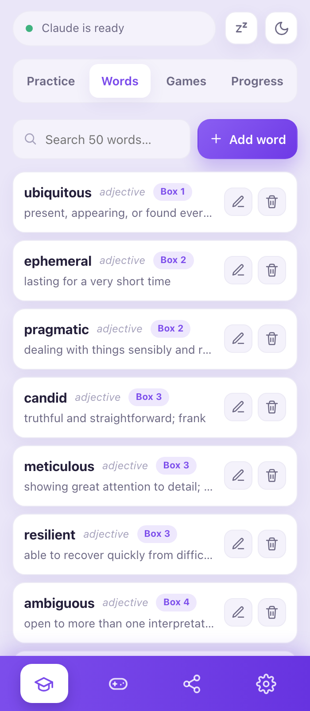
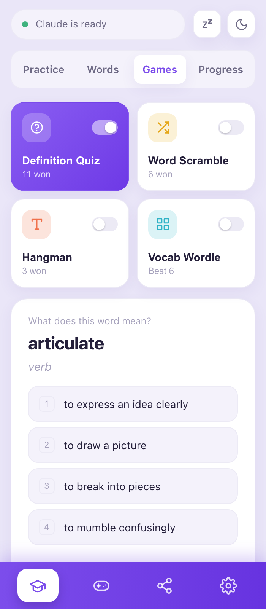
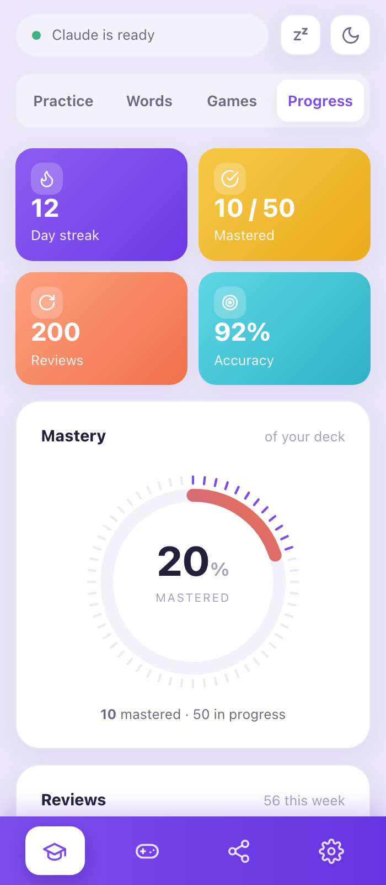
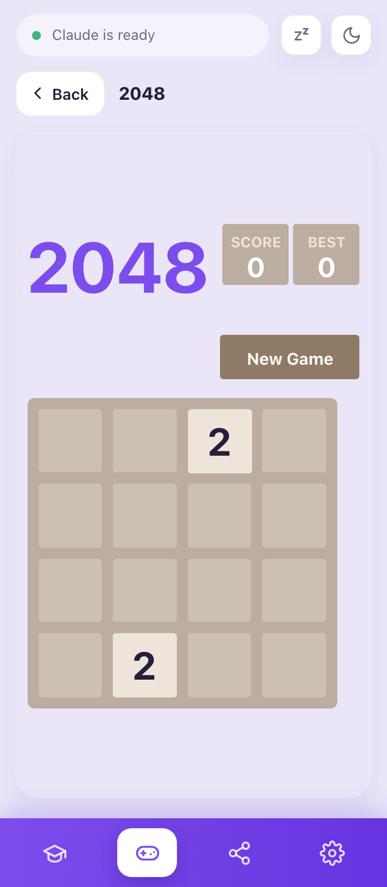
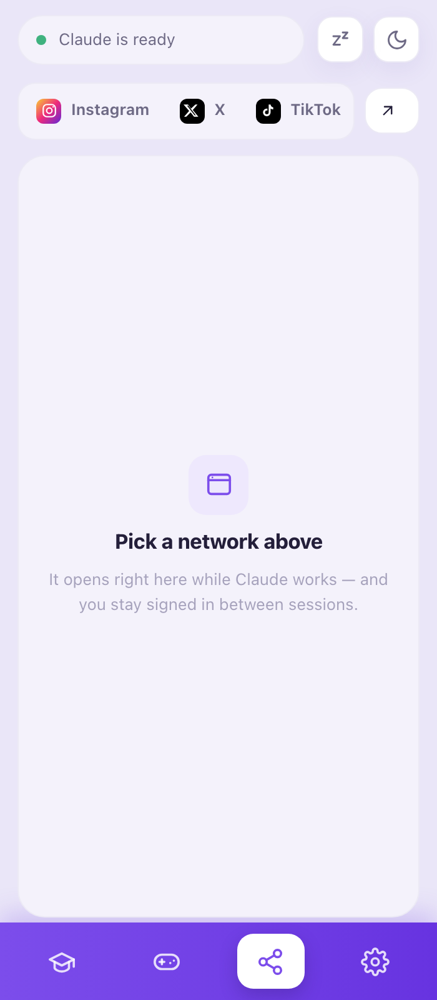
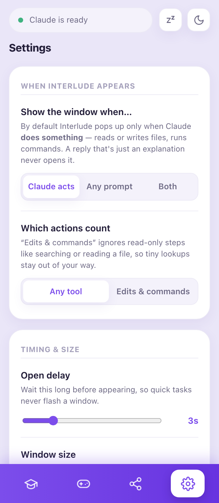
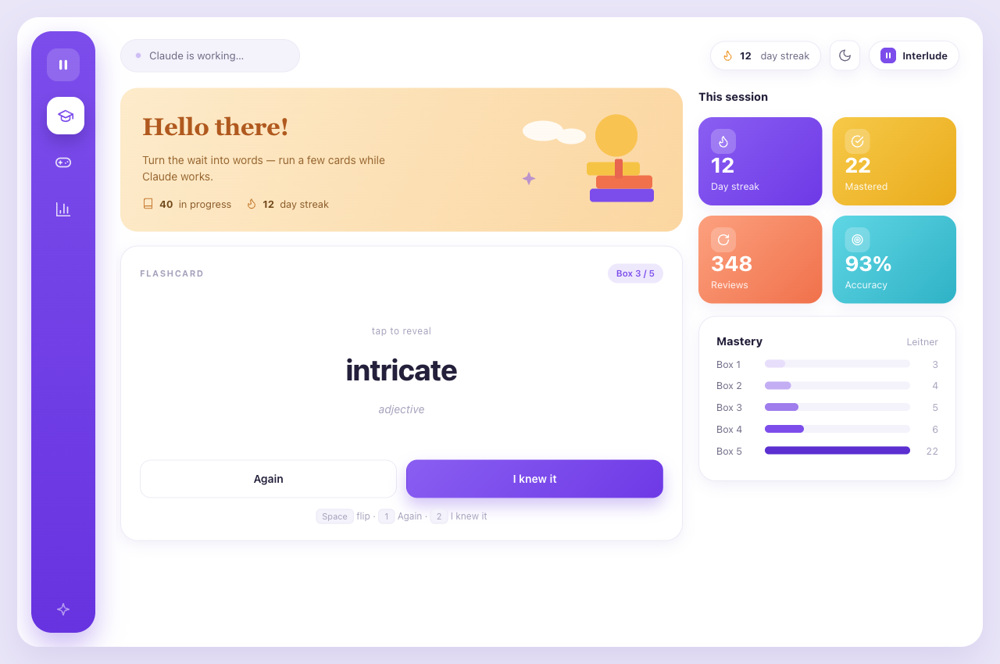

<div align="center">


# Interlude

### Turn Claude's thinking time into your time.

**Interlude** is a tiny, no-typing companion for [Claude Code](https://claude.com/claude-code).
While Claude works, a slim window quietly slides up so you can learn a word, play a quick game, or
just breathe — and browse a little. The moment Claude finishes, needs your input, or hits a wall, it
tells you *which* — with its own colour, sound, and closing behaviour — and gets out of your way
exactly when it's time to read or reply.

<br />

[](#-requirements)
[](https://www.python.org/)
[](#-how-it-works)
[](#-how-it-works)
[](#)
[](LICENSE)

<br />


</div>

<br />

## ✨ Highlights

- 🧠 **Learn while you wait** — spaced-repetition flashcards (Leitner boxes 1–5) surface the words you're about to forget, and speak them aloud on demand.
- 🖼️ **Picture memory aids** — give any word an image URL (from anywhere) and it shows on the flashcard and games as a visual mnemonic — so the picture is always one you chose and actually relevant.
- 🎮 **Word games + Arcade** — eight quick word games (Definition Quiz, Word Scramble, Hangman, Vocab Wordle, retrieval-first **Context Gap**, **Dictation**, **Recall**, and a mini **Word Sudoku** built from a word's letters) that all feed the same spaced-repetition boxes — plus a full-screen **Arcade** with a vendored, MIT-licensed [2048](https://github.com/gabrielecirulli/2048) that **saves and resumes mid-game** — stop halfway, pick up right where you left off.
- 📱 **Social, in the window** — a quick pick of Instagram · X · TikTok, opened right inside the popup for a genuinely mindless glance while you wait.
- 🎛️ **State-aware attention routing** — Interlude sees *why* Claude stopped and reacts differently: **done** (violet, counts down and closes), **needs input** (amber, closes so you can reply), **permission** (red, flashes then closes), **error** (red, stays open with the last line). Optional matching macOS chimes.
- 🕶️ **Snooze / focus** — one click (or `interlude snooze 1h|3h|8h`) mutes the popup and sounds, then auto-resumes.
- 📈 **Progress you can see** — streaks, mastery gauge, review history, and per-box charts.
- 🪄 **Zero friction** — appears on its own while Claude thinks, closes on its own when Claude's done, and reopens right where you left it.
- 🕶️ **No Dock icon, no menu bar** — a native WKWebView popup, not a browser tab or PWA.
- 🔒 **Fully local** — no accounts, no telemetry, no dependencies. Everything runs on `127.0.0.1`.
- 🌗 **Light & dark** — a clean violet theme, day or night.

<br />

## 🚀 Install

**As a Claude Code plugin** (recommended):

```bash
claude plugin marketplace add hamedvali/interlude
claude plugin install interlude@interlude
```

Upgrades come through `claude plugin update interlude`.

**Or with the installer script:**

```bash
curl -fsSL https://raw.githubusercontent.com/hamedvali/interlude/main/install.sh | bash
```

This one registers the hooks itself, installs an `interlude` CLI, and keeps itself up to date.

Either way, **restart Claude Code**. That's it — next time Claude runs for more than a few seconds,
Interlude appears. ✨

Both routes keep your progress in `~/.interlude`, so you can switch between them without losing a
streak. Pick one, though — installing both registers the hooks twice.

> [!NOTE]
> **macOS only.** Requires `python3` and `osascript`, both of which ship with macOS. The window is
> a native WKWebView popup — no browser, no PWA, no Dock icon.

<br />

## 📸 A look inside

<div align="center">

<table>
  <tr>
    <td width="33%" valign="top">
      <br />
      <b>🎴 Practice</b> — one card at a time, scheduled by how well you know it. Press <b>P</b> to hear it.
    </td>
    <td width="33%" valign="top">
      <br />
      <b>📚 Words</b> — a deck manager to browse, search, and curate the words you're learning, with built-in language packs (English · Dutch · German) you can add in a tap — each word read aloud in its own language.
    </td>
    <td width="33%" valign="top">
      <br />
      <b>🧩 Games</b> — eight word games: Quiz, Scramble, Hangman, Wordle, Context Gap, Dictation, Recall, Word Sudoku.
    </td>
  </tr>
  <tr>
    <td width="33%" valign="top">
      <br />
      <b>📊 Progress</b> — mastery gauge, streaks, review history, Leitner boxes at a glance.
    </td>
    <td width="33%" valign="top">
      <br />
      <b>🎮 Arcade</b> — a full-section 2048 that saves and resumes mid-game.
    </td>
    <td width="33%" valign="top">
      <br />
      <b>📱 Social</b> — Instagram · X · TikTok, right inside the window.
    </td>
  </tr>
  <tr>
    <td width="33%" valign="top">
      <br />
      <b>⚙️ Settings</b> — sound, snooze, and the knobs that shape how Interlude behaves.
    </td>
    <td width="33%" valign="top">
      <br />
      <b>👋 Auto-close</b> — a gentle, state-coloured "closing in 3…2…1" when Claude's ready.
    </td>
    <td width="33%" valign="top">
    </td>
  </tr>
</table>

</div>

<br />

## ⚙️ How it works

Interlude installs six **global** [Claude Code hooks](https://docs.claude.com/en/docs/claude-code/hooks)
into `~/.claude/settings.json`. They call a small local control script that manages a
zero-dependency Python web server and a native macOS popup window:

| Hook event            | When it fires                  | What Interlude does                                                    |
|-----------------------|--------------------------------|------------------------------------------------------------------------|
| `UserPromptSubmit`    | You send a prompt              | ⏳ Arms a timer; opens the window if Claude is still busy after ~3s      |
| `PreToolUse`          | Claude is about to run a tool  | 🔁 Keeps the window up and to the front while work continues            |
| `PostToolUse`         | Claude finishes a tool         | 🔁 Marks progress; resets the "is it stuck?" watchdog                   |
| `PostToolUseFailure`  | A tool errors out             | ⚠️ Flags the **error** state so the window can stay open with the reason |
| `Stop`                | Claude finishes replying       | 👋 Shows a state-coloured "closing in 3…2…1" modal, then closes         |
| `Notification`        | Claude needs input / permission| 🚪 Routes to the **needs-input** or **permission** state and steps aside |

The window is a native **WKWebView** popup rendered by `osascript` with an *accessory* activation
policy — so it shows on screen but adds **no Dock icon and no menu bar**. It auto-closes by tracking
its own process, re-surfaces on the next prompt if already open, and restores whatever view you were
last on. Everything runs on `127.0.0.1` — nothing leaves your machine.

<br />

## 🎛️ Attention routing & sound

Interlude is the only tool that already *owns the window*, so it turns that window into a status
display. Every hook maps to a distinct state — legible from across the room:

| State            | Accent | Window does                                  | Optional chime |
|------------------|--------|----------------------------------------------|----------------|
| ✅ **Done**       | violet | counts down and closes                       | soft ding      |
| ✋ **Needs input**| amber  | closes so you can reply                       | mid boop       |
| 🔐 **Permission** | red    | flashes, then closes so you can approve       | double tap     |
| ⚠️ **Error/stuck**| red    | **stays open**, pins the last line of output | low buzz       |

Sound is **opt-in** (default off — it respects alert fatigue). Turn it on with `interlude sound on`
or from **Settings**. It rides the existing status poll, so there's no extra network traffic, and it
plays built-in macOS system chimes via `afplay` — zero new dependencies.

<br />

## 🔄 Auto-update

> [!NOTE]
> This applies to the **installer-script** route. Plugin installs are updated by Claude Code
> itself (`claude plugin update interlude`), so Interlude leaves its own code alone there.

Once installed, Interlude keeps itself current. It checks its GitHub repo in the background
(a few times a day, throttled), and when a newer version is out it **downloads and applies it
for you** — copying the new files in, preserving your progress and saved games, and restarting
its own server on the same port. The open window shows a small toast through the whole
lifecycle (*downloading → installing → updated*) and reloads itself when it's done. Code
updates need no action; only a change to the Claude Code **hook wiring** asks you to restart
Claude Code, and the toast tells you when that's the case.

It only ever **copies files** from the same pinned HTTPS repo you installed from — it never
runs a downloaded script — and every step is best-effort, so a failed check never disrupts a
hook or the app.

```bash
interlude update       # check + apply now (ignores the throttle)
interlude update off   # disable auto-update  (or set INTERLUDE_NO_UPDATE=1)
interlude update on    # re-enable
```

<br />

## 🔁 Sync across machines

Use Interlude on more than one Mac? Point your progress at a shared folder and both machines
stay in step — same deck, streak, history, and game stats. In **Settings ▸ Sync across
machines**, enter a folder inside your **Dropbox** (or iCloud Drive / Google Drive) and hit
**Turn on sync**. Install the sync app and sign into the same account on each Mac, turn sync on
in each, and they'll share one `state.json`.

The first machine you turn on **seeds** the folder from its current progress; the next machine
**adopts** what's already there. Your local `~/.interlude/state.json` is never deleted, so
turning sync off just falls back to it. Only progress is shared — window size and other settings
stay per-machine. Use one machine at a time and let the folder finish syncing before switching;
writes are atomic, so you'll never get a half-written file.

<br />

## 🖼️ Word images

Any word can show a picture as a visual memory aid — on the flashcard front, next to the word in the
Definition Quiz, and on the reveal after you solve Scramble / Hangman / Wordle (never during play, so
nothing is spoiled). Pictures are **opt-in per word**: tap the small **🖼️ picture button** next to
the word in any game (or the word's editor) and paste an **image URL** from any source. Only that word
gets a picture. Nothing is auto-fetched, so every image is one you chose and actually relevant.

<br />

## 🧩 How the games help you learn

The word games aren't just filler — they're ordered by how hard your brain has to *pull* the word
back, because effortful retrieval is what actually builds memory (the "testing effect"). Each game
feeds the same Leitner boxes, so playing them schedules your future reviews:

- **Recall** — you see only the definition and type the word from memory. This is *free recall*, the
  most demanding and most durable form of practice.
- **Context Gap** — the word is blanked out of a real example sentence for you to fill in (*cloze*),
  giving you a contextual cue without handing you the answer.
- **Dictation** — you hear the word and type it, tying sound to spelling to meaning.
- **Definition Quiz** — multiple choice, the gentlest retrieval, good for shaky new words.
- **Scramble · Hangman · Wordle** — spelling-focused play that reinforces the letters.
- **Word Sudoku** — a mini 6×6 logic puzzle whose six symbols are a word's distinct letters (revealed
  on solve). More of a word-themed brain break than a memory test, but a lighter exposure all the same.

A picture and a pronunciation appear on every answer reveal, so each round layers meaning, sound,
and image onto the same word.

<br />

## 🎛️ Controls

```bash
interlude off             # pause Interlude (stops opening the window)
interlude on              # resume
interlude snooze 1h       # mute popup + sounds for 1h (also 3h, 8h), then auto-resume
interlude snooze off      # end the snooze now
interlude sound on        # enable state-aware chimes (off by default)
interlude sound off       # silence them
interlude status          # show version, server, window, and attention state as JSON
interlude update          # check for and apply a new version now
interlude stop-server     # stop the background web server
interlude version         # print the version
```

If `~/.local/bin` isn't on your `PATH`, run it directly:
`python3 ~/.interlude/interlude.py <command>`.

<br />

## 🎨 Customize

- **📝 Words** — edit `~/.interlude/words.json` (a list of `{word, meaning, …}`), or curate the deck live from **Learn ▸ Words**. Tap **Packs** there to add a built-in language pack — English, Dutch, or German — into your deck.
- **⏱️ Open delay** — set `INTERLUDE_DELAY` (seconds) before the window appears (default `3`).
- **📐 Window size** — set `INTERLUDE_WIDTH` / `INTERLUDE_HEIGHT` (default `350`×`800` — a slim companion strip).
- **🔊 Sound** — `interlude sound on|off`, or the toggle in **Settings** (default off).
- **🔌 Port** — set `INTERLUDE_PORT` (default `47615`) if it clashes with something.

Changes to hooks or env take effect after you restart Claude Code.

<br />

## 🧹 Uninstall

```bash
curl -fsSL https://raw.githubusercontent.com/hamedvali/interlude/main/uninstall.sh | bash
```

This removes the hooks (with a settings backup), the `interlude` CLI, and `~/.interlude`.
Add `--keep-data` to preserve your learning progress.

<br />

## 🛠️ Development

Clone the repo and install from your local checkout — no download, no GitHub needed:

```bash
git clone https://github.com/hamedvali/interlude.git
cd interlude
bash install.sh --local
```

The app lives in `app/`:

| File            | Role                                                              |
|-----------------|-------------------------------------------------------------------|
| `interlude.py`  | Hook controller — decides when to open/close and routes state     |
| `webview.js`    | The native WKWebView popup, run via `osascript`                   |
| `server.py`     | Zero-dependency stdlib web server                                 |
| `app.html`      | The single-page UI — Learn / Arcade / Social / Settings           |
| `games/`        | Vendored MIT arcade games + the save/resume bridge & theme        |

The UI has a four-item nav rail — **Learn** (with Practice / Words / Games / Progress sub-tabs),
**Arcade**, **Social**, and **Settings**. Arcade games live in `app/games/<id>/` with their upstream
`LICENSE` kept verbatim. A tiny shared `games/_bridge.js` mirrors each game's `localStorage` to the
server so play resumes mid-game, and `games/_theme.css` blends them with the Interlude theme. See
[`app/games/CREDITS.md`](app/games/CREDITS.md) for attributions and how to add more.

`INTERLUDE_HOME` overrides the install location — handy for isolated testing.

<br />

## 📋 Requirements

- 🍎 **macOS**
- 🐍 **`python3`** and **`osascript`** — both ship with macOS

<br />

## 📄 License

[MIT](LICENSE) © Hamed Valigholizadeh

Bundled arcade games are third-party open-source projects under their own (MIT) licenses,
kept verbatim in `app/games/<id>/LICENSE`. See [`app/games/CREDITS.md`](app/games/CREDITS.md).

<div align="center">
<br />
<sub>Built for the little pauses. 🎴</sub>
</div>
